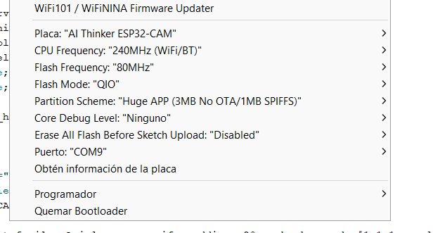
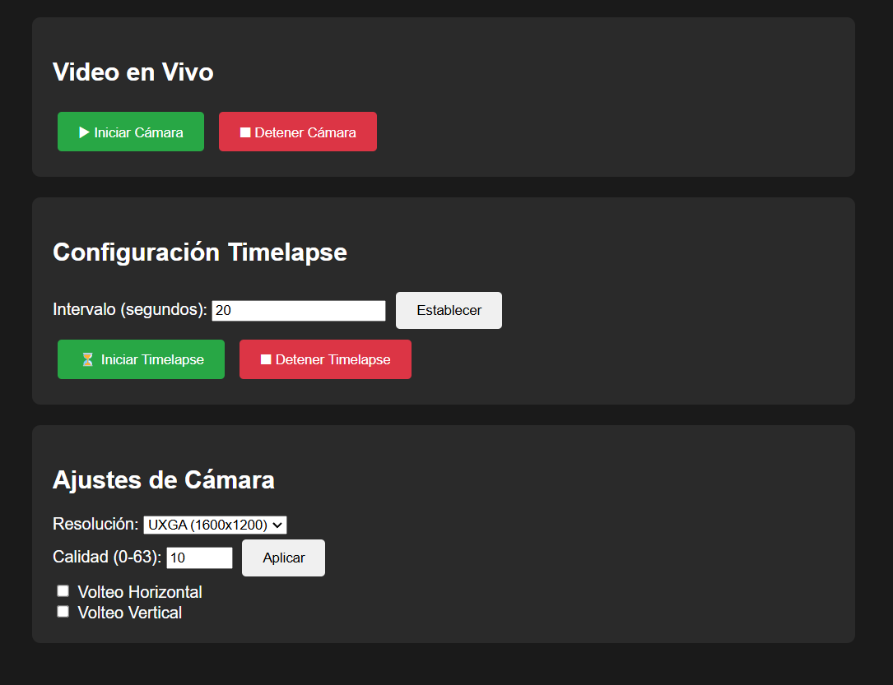
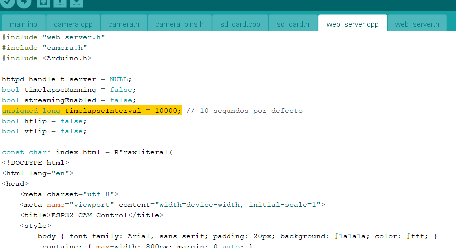

<br>
## Creación de una cámara con timelapse con página web propia. Creado por TecXarT.
<br>
Version 1.0 <br>
- Actualmente funciona la pag. web con la ip que da el monitor serie, pero el cambio del timelapse en la web no funciona.
  - Para cambiar el volteo de la imagen, el stream debe estar parado.
<br>
<br>
* Por el momento no hay ninguna modificación más.
<br>

> [!IMPORTANT]
> En la imagen puedes ver la configuración de la placa para que funcione, recuerda poner el monitor en 115200 beaudio.
<br>


<br>
- En la siguiente imagen podrás ver el diseño de la web, cualquier duda o consulta puedes preguntarme.
<br>



<br>
Para cambiar el tiempo del timelapse ya que no funciona en la web aunque está implementado tendrás que cambiar la linea del web_server.cpp donde pone:
<br>
#### EDITO: EL TIMELAPSE ESTÁ ARREGLADO PERO SI QUIERES CAMBIARLO DESDE EL PROGRAMA DE ARDUINO DEJO DONDE CAMBIARLO.

```
unsigned long timelapseInterval = 10000;
```
#### Aquí puedes ver la linea que tienes que cambiar.



> [!NOTE]
> Si tienes iniciado el video en vivo el timelapse no funcionará, debes parar el video para que funcione el timelapse y al revés también.


