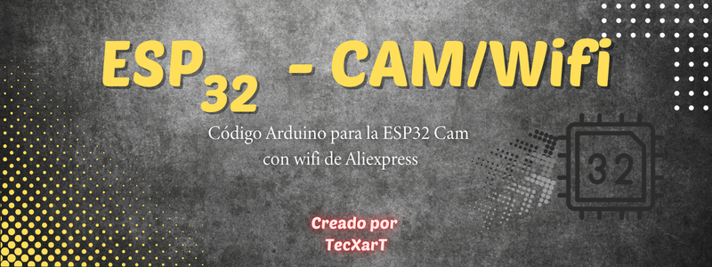

 
## Creación de una cámara con timelapse con página web propia. Creado por TecXarT.
 
Version 1.0
- Actualmente funciona la pag. web con la ip que da el monitor serie, pero el cambio del timelapse en la web no funciona.
  - Para cambiar el volteo de la imagen, el stream debe estar parado.
 
* Por el momento no hay ninguna modificación más.
